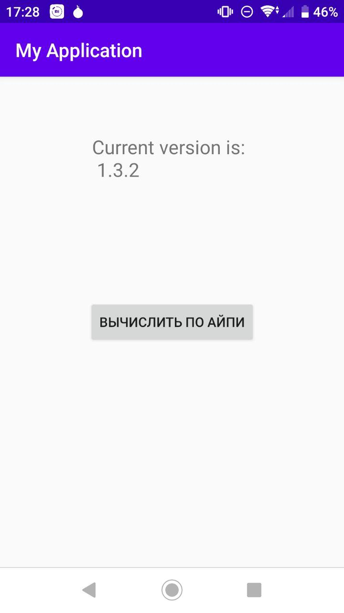
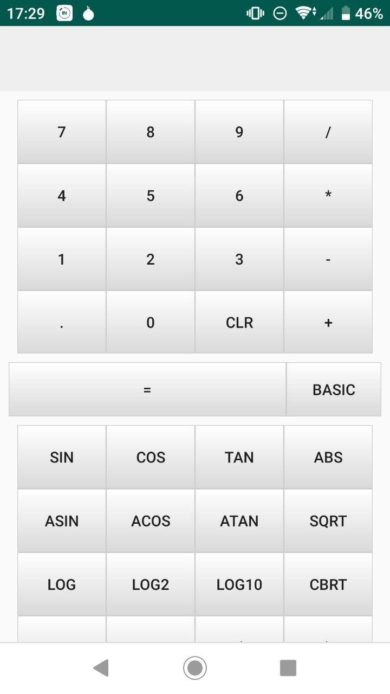
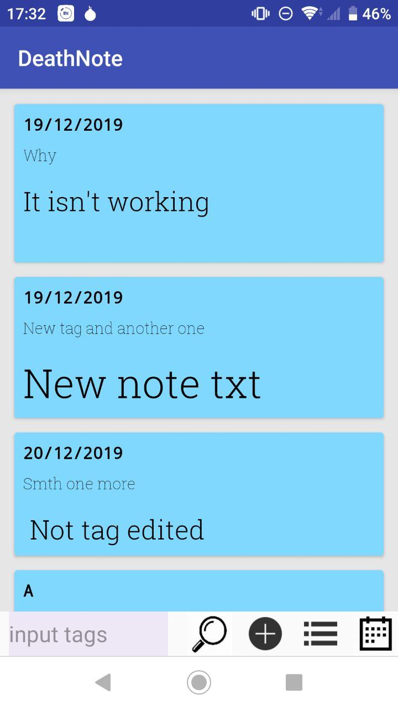
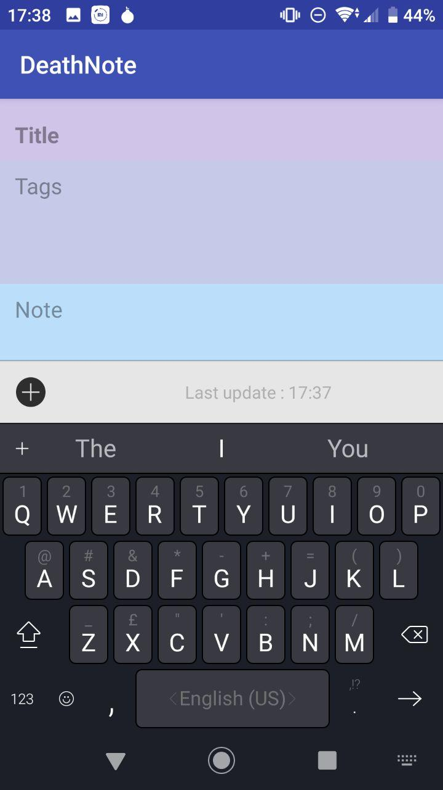
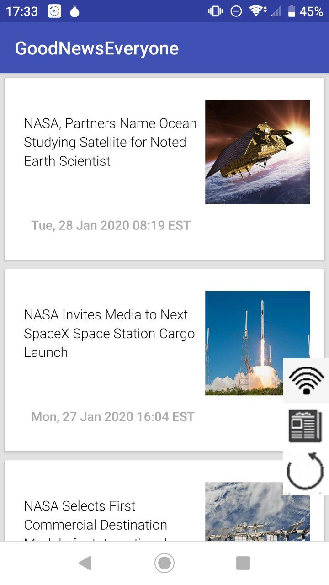

## What is going on
This repository contains four android project: simple hello-world application, calculator, notes app and rss-reader. The text below is requirements for each one accompanied by a screenshot of completed task.     

## Table of Contents

- [Tasks](#Tasks)
  - [Lab 1 - Hello world](#1-hello-world)
  - [Lab 2 - Numbers Mason, what do they mean?](#2-numbers-mason-what-do-they-mean)
  - [Lab 3 - Gotta note them all!](#3-gotta-note-them-all)
  - [Lab 4 - Yet another feed](#4-yet-another-feed)

# Tasks

## 1. Hello world

1. Create a plain Android App project. (target version is Android 6). All work must be performed inside git repository.
2. Set-up a basic app versioning. Application package should have proper version code and version name according to SEMVER (Semantic Versioning). Version name should contain major, minor and patch version digits. Version tracking should be performed by utilizing git tag feature. Each tag should be formatted as "MAJOR.MINOR" (e.g. 1.3), PATCH number represents a number of commits performed after latest release (latest tag).
3. Resulting **release** APK should be signed with personal certificate automatically during build.
4. The only activity of application should display current version name and device ID (which is secured by corresponding runtime permission).
5. You should properly handle runtime permission and give user a dummy explanation why it is necessary to grant this permission. App should withstand screen rotation and other possible test-cases.

<!---->

## 2. Numbers Mason, what do they mean?

1. Create 'Calculator' app.
2. Application should have two modes: basic and scientific (see, well, any calculator for reference).
3. Modes can be toggled via interface button.
4. Each set of functions (numbers + basic functions and scientific functions) should be in separate fragments.
5. For landscape device orientation app should always be in scientific mode.
6. Create a 'demo' build flavor with only basic functions available for both screen orientations. User should be able to have both 'demo' and 'full' versions on device at the same time.

## 3. Gotta note them all!

1. Create 'Notes' application. (see Google Keep for reference).
2. App should show a list or a grid of created notes depending on screen orientation (list for portrait and grid for landscape).
3. Each note should consist of title, body and tag list. Title may not be empty. If user left it out empty, a current date should be used instead. Tag list may be empty.
4. List or grid may be sorted by date or note title. User can also browse notes by particular tag.
5. Any data storage option may be used. Note list should be persisted across app launches.

Try to use components from google material design. Take a look at android app architecture guides across internet to avoid common pitfalls.

## 4. Yet another feed

1. Create RSS reader application (see Flipboard for reference).
2. On first launch app asks user to type in RSS feed URL. This can be changed later.
3. RSS entities are displayed within list view. EAch entity should contain date, title, preview of content and an image (if provided by feed source).
4. When user taps on list item, a WebView with full entity should be displayed.
5. 10 recently fetched news should be cached and available to user even if no network is available.
6. App should track and display network state (icon, snackbar, etc). User should be aware when app goes offline and online.
7. All network operations should not block user interface and should have loading indicator if necessary.

    
